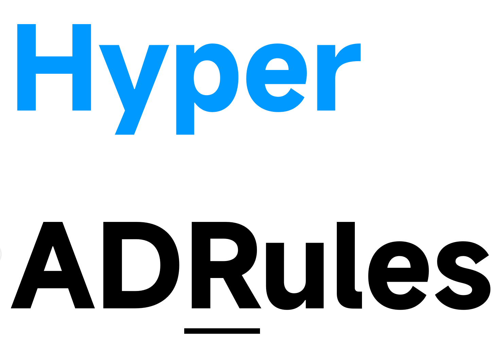

<div align="center">
  
  <h1>HyperADRules</h1>
  <p><strong>下一代广告 / 恶意域名规则聚合</strong><br/>
  多上游合并 · 保守 DNS 语义 · 多客户端一键订阅</p>

  <p>
    <a href="https://github.com/Lynricsy/HyperADRules/actions/workflows/build-release.yml">
      
    </a>
    <a href="https://github.com/Lynricsy/HyperADRules/releases/latest">
      
    </a>
    <a href="https://github.com/Lynricsy/HyperADRules/stargazers">
      
    </a>
    <a href="https://github.com/Lynricsy/HyperADRules/releases">
      
    </a>
  </p>

  <p>
    
    
    
    
    
  </p>

  <p>
    <a href="#快速开始">快速开始</a> ·
    <a href="#产物一览">产物</a> ·
    <a href="#转换策略">转换策略</a> ·
    <a href="#本地构建">本地构建</a>
  </p>
</div>

---

## 这是什么

**HyperADRules** 是广告与恶意域名规则聚合项目：

- 定时拉取多个 DNS 级上游，合并去重
- **保守语义**：路径 / 端口 / 无法表达的 modifier **跳过**，绝不静默扩大为整域误杀
- 一次构建，输出 **mihomo MRS / sing-box SRS / Clash / Surge / dnsmasq / SmartDNS / AdGuard** 等格式
- 空 `ipcidr` 集合也会发布合法空资产，订阅 URL **不会 404**

请通过下方 **Release 订阅** 使用规则产物。

### 上游来源

| 上游 | 用途 |
|---|---|
| [AdGuard Home For Magisk Mod](https://github.com/liuzq2002/Adguard-Home-For-Magisk-Mod) | ads / malware / allow 主过滤器 |
| [anti-AD](https://github.com/privacy-protection-tools/anti-AD) | Clash payload 广告域 + 例外 |
| [dead-horse whitelist](https://raw.githubusercontent.com/privacy-protection-tools/dead-horse/master/anti-ad-white-for-clash.yaml) | 并入 allow |
| [Coolapk 1007 reward](https://raw.githubusercontent.com/lingeringsound/10007/main/reward) | 补充 ads hosts |

---

## 快速开始

### mihomo / Clash Meta（推荐）

把规则放进 `sub-rules`，白名单用 `PASS`：只退出本项目过滤，不强制直连。

```yaml
rule-providers:
  hyper_allow:
    type: http
    behavior: domain
    format: mrs
    path: ./ruleset/adrules_ultra_allow.mrs
    url: https://github.com/Lynricsy/HyperADRules/releases/latest/download/adrules_ultra_allow.mrs
    interval: 86400

  hyper_allow_ipcidr:
    type: http
    behavior: ipcidr
    format: mrs
    path: ./ruleset/adrules_ultra_allow_ipcidr.mrs
    url: https://github.com/Lynricsy/HyperADRules/releases/latest/download/adrules_ultra_allow_ipcidr.mrs
    interval: 86400

  hyper_ads:
    type: http
    behavior: domain
    format: mrs
    path: ./ruleset/adrules_ultra_ads.mrs
    url: https://github.com/Lynricsy/HyperADRules/releases/latest/download/adrules_ultra_ads.mrs
    interval: 86400

  hyper_ads_ipcidr:
    type: http
    behavior: ipcidr
    format: mrs
    path: ./ruleset/adrules_ultra_ads_ipcidr.mrs
    url: https://github.com/Lynricsy/HyperADRules/releases/latest/download/adrules_ultra_ads_ipcidr.mrs
    interval: 86400

  hyper_malware:
    type: http
    behavior: domain
    format: mrs
    path: ./ruleset/adrules_ultra_malware.mrs
    url: https://github.com/Lynricsy/HyperADRules/releases/latest/download/adrules_ultra_malware.mrs
    interval: 86400

  hyper_malware_ipcidr:
    type: http
    behavior: ipcidr
    format: mrs
    path: ./ruleset/adrules_ultra_malware_ipcidr.mrs
    url: https://github.com/Lynricsy/HyperADRules/releases/latest/download/adrules_ultra_malware_ipcidr.mrs
    interval: 86400

rules:
  - SUB-RULE,(NETWORK,tcp),hyper_filter
  - SUB-RULE,(NETWORK,udp),hyper_filter
  # 这里继续你的代理 / 直连 / 地区分流
  - MATCH,DIRECT

sub-rules:
  hyper_filter:
    - RULE-SET,hyper_allow,PASS
    - RULE-SET,hyper_allow_ipcidr,PASS,no-resolve
    - RULE-SET,hyper_ads,REJECT
    - RULE-SET,hyper_ads_ipcidr,REJECT,no-resolve
    - RULE-SET,hyper_malware,REJECT
    - RULE-SET,hyper_malware_ipcidr,REJECT,no-resolve
    - MATCH,PASS
```

**注意**

- 不要把 allow 写成 `DIRECT`，否则例外域名无法再走你后面的代理规则
- 不要把 `PASS` 白名单和 `REJECT` 平铺在同一层 `rules` 里

### 手动下载

```bash
mkdir -p ruleset && cd ruleset
base=https://github.com/Lynricsy/HyperADRules/releases/latest/download

curl -fLO "$base/adrules_ultra_allow.mrs"
curl -fLO "$base/adrules_ultra_allow_ipcidr.mrs"
curl -fLO "$base/adrules_ultra_ads.mrs"
curl -fLO "$base/adrules_ultra_ads_ipcidr.mrs"
curl -fLO "$base/adrules_ultra_malware.mrs"
curl -fLO "$base/adrules_ultra_malware_ipcidr.mrs"
curl -fLO "$base/SHA256SUMS"

sed 's#  dist/#  #' SHA256SUMS | sha256sum -c --ignore-missing
```

---

## 产物一览

GitHub Actions 每天 UTC `20:23` 构建并发布。文件名中 `{kind}` = `ads` / `allow` / `malware`。

| 文件 | 客户端 | 说明 |
|---|---|---|
| `adrules_ultra_{kind}.mrs` | mihomo | domain 二进制 |
| `adrules_ultra_{kind}_ipcidr.mrs` | mihomo | ipcidr 二进制；**空集也会发布** |
| `adrules_ultra_{kind}_singbox.srs` | sing-box ≥ 1.10 | 二进制 rule-set |
| `adrules_ultra_{kind}_singbox.json` | sing-box | SRS 源 |
| `adrules_ultra_{kind}_clash.yaml` | Clash | `behavior: domain` |
| `adrules_ultra_{kind}_clash_ipcidr.yaml` | Clash | `behavior: ipcidr`；空集 `payload: []` |
| `adrules_ultra_{kind}.txt` | mihomo text | 保留 `+.` / `.` 语义 |
| `adrules_ultra_{kind}_ipcidr.txt` | mihomo text | 无规则时注释占位 |
| `adrules_ultra_{kind}_domains.txt` | Pi-hole 等 | exact + suffix 字面量 |
| `adrules_ultra_{kind}_surge.txt` / `_surge2.txt` | Surge | DOMAIN* / DOMAIN-SET |
| `adrules_ultra_{kind}_adguard.txt` / `_easylist.txt` | AdGuard | 文本规则 |
| `adrules_ultra_{ads,malware}_dnsmasq.conf` | dnsmasq | 仅 suffix 阻断 |
| `adrules_ultra_{ads,malware}_smartdns.conf` | SmartDNS | 仅 suffix 阻断 |
| `manifest.md` / `stats.json` / `SHA256SUMS` | - | 统计与校验 |

### Release tag

- 新 tag：`snapshot-YYYYMMDD`（UTC 日期）
- notes 含 `CONTENT_ID`（`SHA256SUMS` 指纹前 16 位）
- 同日重跑：完整且 checksum 一致则跳过；残缺则删重建

---

## 转换策略

只保留 DNS / domain 层能**完整表达**的规则：

| 输入 | 结果 |
|---|---|
| `\|\|example.com^` | `+.example.com` |
| `@@\|\|example.com^` | allow 集合 |
| `\|\|1.2.3.4^` / CIDR | ipcidr |
| hosts `0.0.0.0 ads.example.com` | exact domain |
| `\|\|example.com/path`、`:8443`、query/fragment | **跳过**（不整域扩大） |
| 无法表达的 `$script` 等 modifier | **跳过** |
| 安全 wildcard | 保留为 Clash/mihomo 可编译形式 |

跳过原因会进入 `unsupported_path` / `unsupported_port` / `unsupported_modifier` 统计。

---

## 本地构建

```bash
git clone --depth=1 https://github.com/liuzq2002/Adguard-Home-For-Magisk-Mod upstream-adguard
git clone --depth=1 https://github.com/privacy-protection-tools/anti-AD upstream-anti-ad
curl -fsSL https://raw.githubusercontent.com/privacy-protection-tools/dead-horse/master/anti-ad-white-for-clash.yaml \
  -o upstream-anti-ad/anti-ad-white-for-clash.yaml
curl -fsSL https://raw.githubusercontent.com/lingeringsound/10007/main/reward \
  -o upstream-coolapk-1007-reward.txt

uv run python -m scripts.build_rulesets \
  --adguard-source upstream-adguard \
  --anti-ad-source upstream-anti-ad \
  --coolapk-1007-reward-source upstream-coolapk-1007-reward.txt \
  --output dist \
  --adguard-commit "$(git -C upstream-adguard rev-parse HEAD)" \
  --anti-ad-commit "$(git -C upstream-anti-ad rev-parse HEAD)" \
  --dead-horse-commit "$(sha256sum upstream-anti-ad/anti-ad-white-for-clash.yaml | cut -d ' ' -f 1)" \
  --coolapk-1007-reward-commit "$(sha256sum upstream-coolapk-1007-reward.txt | cut -d ' ' -f 1)"
```

生成二进制：

```bash
mihomo convert-ruleset domain text dist/adrules_ultra_ads.txt dist/adrules_ultra_ads.mrs
# 空 ipcidr 由流水线写入合法空 MRS；有规则时同样 convert-ruleset ipcidr

sing-box rule-set compile --output dist/adrules_ultra_ads_singbox.srs dist/adrules_ultra_ads_singbox.json
```

---

## 反馈

误杀 / 漏拦欢迎开 Issue。规则会定期从上游重建；本仓库只做**保守、可追溯**的格式转换与发布。
